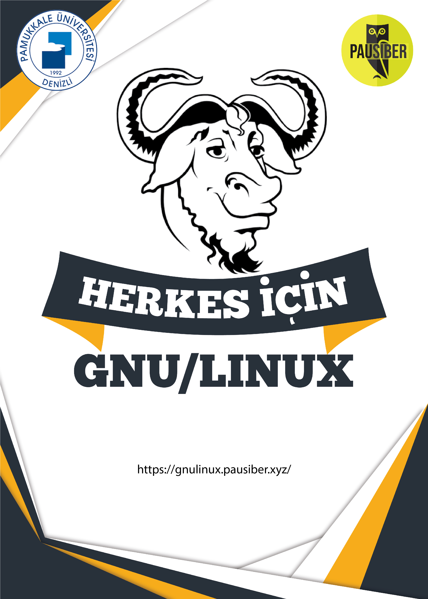

> Kurs dokümanları ve eğitimden fotoğraflara bu adres üzerinden de erieşbilirsiniz.  
  [**`https://gnulinux.pausiber.xyz`**](https://gnulinux.pausiber.xyz)

**Kurs Eğitmenleri:** [**abdullahbagyapan**](https://github.com/abdullahbagyapan) && [**mertkirgil**](https://github.com/mertkrgl) && [**eneskaya**](https://github.com/eneskaya12) && [**cerensukaramese**](https://github.com/cerensukaramese)

---

|     Hafta     |      İçerik    |
| :------------ | :------------- |
| **`hafta 0`** | [Linux'un genel tanımı ve gerekli kurulumların gerçekleştirilmesi.](https://gnulinux.pausiber.xyz/haftalar/hafta-sifir) |
| **`hafta 1`** | [Terminal kullanımını ve Temel Komutlar, Dosya sistem hiyerarşisi, Paket yöneticisi kavramı](https://gnulinux.pausiber.xyz/haftalar/hafta-bir)|
| **`hafta 2`** | [Kullanıcı-Grup Yönetimi ve Dosya-Dizin İzinleri](https://gnulinux.pausiber.xyz/haftalar/hafta-iki)|
| **`hafta 3`** | [Server kavramının açıklanması, SSH Kullanımı](https://gnulinux.pausiber.xyz/haftalar/hafta-uc) |
| **`hafta 4`** | [Kriptoloji bilimi, Şifreleme algoritmaları, Rastgelelik](https://gnulinux.pausiber.xyz/haftalar/hafta-uc) |

---

	
   
	<em>Eğitimin afişi</em>

