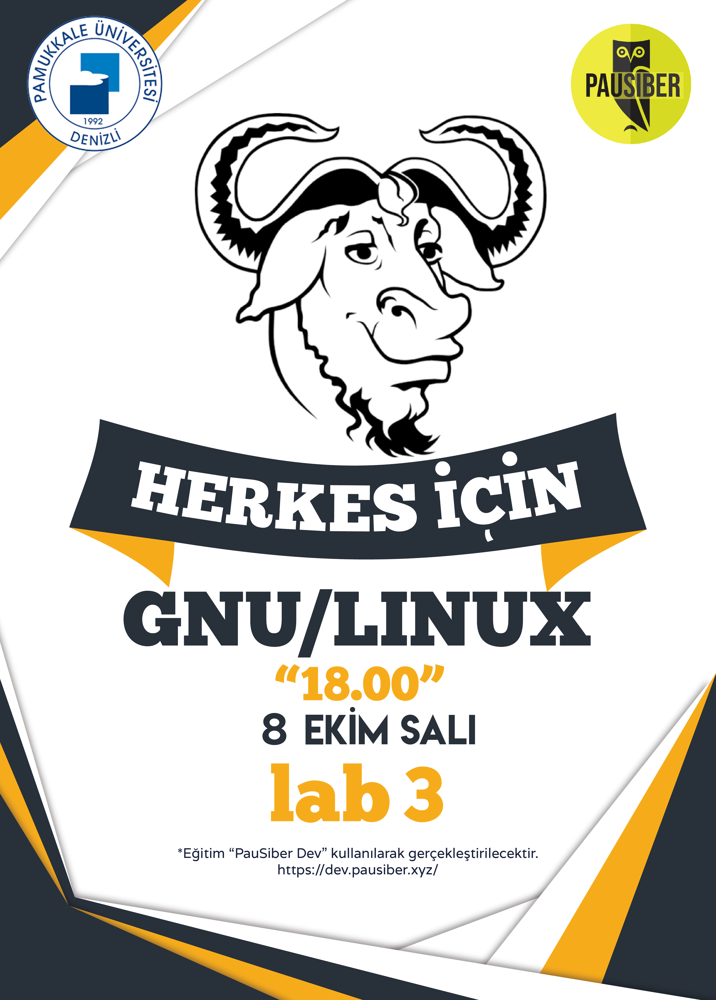

> Kurs dokümanları ve eğitimden fotoğraflara bu adres üzerinden de erieşbilirsiniz.  
  [**`https://gnulinux.pausiber.xyz`**](https://gnulinux.pausiber.xyz)

**Kurs Eğitmenleri:** [**boratanrikulu**](https://github.com/boratanrikulu) && [**hasantezcan**](https://github.com/hasantezcan)  && [**emrullahcirit**](https://github.com/emrullahcirit)

---

|     Hafta     |      İçerik    |
| :------------ | :------------- |
| **`hafta 0`** | [Linux'un genel tanımı ve PauSiber Dev kurulumu](hafta0/hafta0.md) |
| **`hafta 1`** | [Terminal kullanımını ve Temel Komutlar, Dosya sistem hiyerarşisi, Paket yöneticisi kavramı](hafta1/hafta1.md)|
| **`hafta 2`** | [Kullanıcı-Grup Yönetimi ve Dosya-Dizin İzinleri](hafta2/hafta2.md)|
| **`hafta 3`** | [Server kavramının açıklanması, SSH Kullanımı, Zamanlanmış görevler oluşturulması](hafta3/hafta3.md) | 
| **`hafta 4`** | Servis kavramının açıklanması, Systemctl Kullanımı, LAMP ve Wordpress Kurulumu | 

---

	
   
	<em>2019-10-08 tarihli eğitimin afişi</em>

### **`Eğitmen İletişim Bilgileri`**

> **Bora Tanrıkulu :** [**Telegram**](https://t.me/boratanrikulu/), [**Twitter**](https://twitter.com/boratanrikulu_/)
,[**Instagram**](https://www.instagram.com/boratanrikulu/)

> **Hasan Tezcan :** [**Telegram**](https://t.me/hasantezcan/), [**Twitter**](https://twitter.com/hasantezcann/), [**Instagram**](https://www.instagram.com/hasantezcan/)

> **Emrullah Cirit :** [**Telegram**](https://t.me/emrullahcirit/), [**Twitter**](https://twitter.com/Iamemrullah), [**Instagram**](https://www.instagram.com/emrullah.cirit/)
