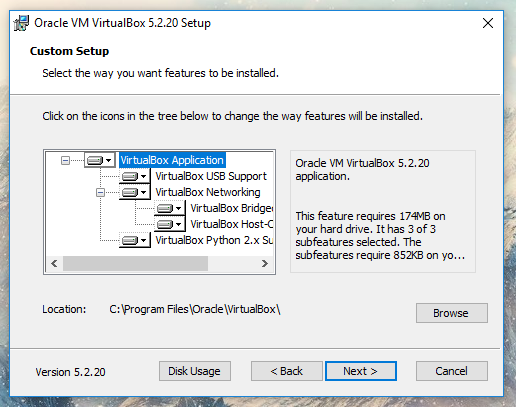
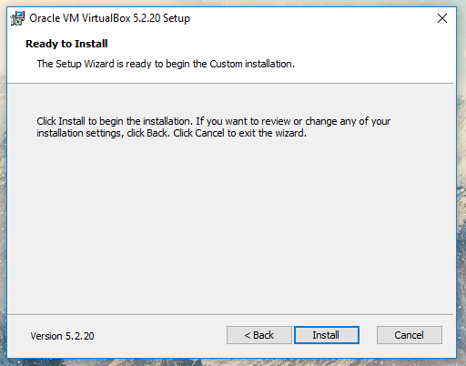
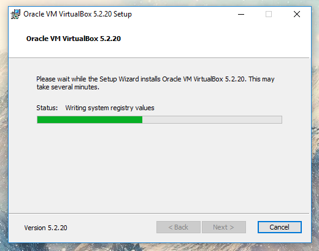

# Hafta 0

**Amaç :** Linux'un genel bir tanımı. PauSiber Dev kurulumunun gerçekleştirilmesi.  

**Yazarlar :** [**boratanrikulu**](https://github.com/boratanrikulu) **&&** [**hasantezcan**](https://github.com/hasantezcan)

---

## Linux Nedir ?

Linux C dili yazılmış bir çekirdektir.  

1991'de UNIX'e bir alternatif olması amacıyla, Linus Torvalds tarafından, UNIX'den esinlenerek yazılmıştır. Linux'ta UNIX'den direkt olarak alınmış hiç bir kod bulunmamaktadır.  

POSIX standartlarına uygun olarak yazılan Linux, GNU Genel Kamu Lisansı ile sunulan ve Linux Vakfı çatısı altında geliştirilen bir özgür yazılım projesidir. 

> Daha detaylı bilgi için **Just for Fun : The Story of an Accidental Revolutionary by Linus Benedict Torvalds**

**Peki çekirdek nedir ?** 

Çekirdek, yani kernel, işletim sisteminin kalbidir. Uygulamalar ve donanım arasında çevirici görev görür. Fiziksel donanımla yazılım arasındaki haberleşmeyi sağlar.  

	

Yani Linux tek başına bir işletim sistemi değildir.  

**Peki işletim sistemi (operating system) nedir ?**  

İşletim sistemi, bilgisayarı kullanabilmemiz için gerekli olan yazılımlar bütünüdür. Örneğin önünüzde bulunan Windows bir işletim sistemidir. İşletim sistemi User Interface (shell) ve Kernel'dan oluşur.

	

İşletim sistemleri ve kernel bir bütün halinde çalışır. **Yani Linux için tek başına bir işletim sistemi diyemeyiz.**

---

GNU isimli de bir işletim sistemi vardır. Özgür yazılım felsefesini amaç edinen bu işletim sistemi 1983'de Richard Stallman tarafından duyurulmuştur.

Belli bir süre HURD çekirdeğini kullanan GNU; 1991'de Linus Torvals tarafından Linux'un duyurulması ve **Linux çekirdeğinin popülerlik kazanmasıyla, GNU işletim sisteminde, çekirdek olarak Linux'a geçiş yapılmıştır.** GNU araçları Linux'a uyarlanmış ve böylelikle HURD'ın gelişimi iyiden iyiye yavaşlamıştır.

Günümüzde HURD'ın 1. versiyonu halen çıkarılamamıştır.

Bu sebeplerden dolayı yalnızca Linux demek yanlıştır. **GNU/Linux** olarak söylenmesi daha doğrudur.  
(Richard **<3**)

	

---

## GNU/Linux'a Neden İhtiyacımız Var ?

Açıkçası bu bir tercih meselesi. İşletim sistemi bir araçtır. **Sizin için en doğru araç, amacınıza en uygun olan araçtır.**

GNU/Linux'un size sağlayacağı bir çok avantaj var.

- Yüksek düzeyde **özelleştirilebilmesi.**  
- **Ücretsiz** olması (her dağıtım ücretsiz değildir)  
- **Hızlı ve Kararlıdır** (Donanım desteği olduğu taktirde)
- GNU/Linux için **zararlı yazılım sayısının az olması**
- **Özgür Yazılım** olması
- Açık kaynak olduğu için, **sorun tespitinin ve çözümünün oldukça hızlı olması** (community)  
- Yardım bulabilmeniz için bir çok topluluğun(community) olması; **bir şirkete bağlı değilsiniz, yalnız değilsiniz!**

---

## Özgür Yazılım Nedir ?

**Özgür Yazılım bir özgürlük meselesidir, fiyat değil.**

Bu yanlış anlaşılmanın sebebi; *free* sözcüğünün hem ücretsiz hem de özgür manasına gelmesinden ortaya çıkıyor.

***To understand the concept, you should think of “free” as in “free speech,” not as in “free beer”.***

Özgür yazılım insanları öğrenmeye, öğrendiklerini öğretmeye, kısıtlı ömrümüzde kazandığımız bilgileri gelecek nesillere bilgi birikimi olarak bırakmaya, bir defa yapılmış bir şeyin yapımı için gereken tekniği tekrar tekrar bulunmasına gerek bırakmamaya teşvik eder.

Kısacası Özgür Yazılım **tüm insanlığa hizmet eder**, yanlızca **bir grup insanın cebine değil.**

---

#### Bir Yazılım Nasıl Özgür Yazılım Olur?

Bir yazılımın özgür olması için yerine getirmesi gereken 4 kriter vardır.

0. **Çalıştırılabilirlik:** Bir yazılım istendiği şekilde ve doğrultuda çalıştırılabilir.

1. **Değiştirilebilirlik:** Herhangi bir yazlım istendiği amaç doğrultusunda değiştirilebilir. İstediğimiz şekilde ekleme çıkarma yapılabilinir.*(Yazılımın kaynak koduna erişim (open source) bunun için bir önşarttır.)*

2. **Dağıtılabilirlik:**  Yazılım herhangi biri tarafından tekrardan dağıtılabilir, toplulukla bunu paylaşabilir.

3. **Değiştirip Dağıtılabilirlik:** Bir yazılımı istediğimiz gibi çalıştırıp, değiştirdiğimiz gibi o yazılımı istediğimiz doğrultuda değiştirip ve geliştirip bu haliyle yeniden dağıtabiliriz.

Tüm bu şartları yerine getirebilen her yazılım **özgürdür.**

---

## Distro (Dağıtım) nedir ?

GNU/Linux isimli indirip kurabileceğiniz bir işletim sistemi aslında yoktur. Bir çok distro vardır.

Distro, yani dağıtım, özgür yazılım felsefesinin çok alternatifli dünyasının bir sonucu olarak ortaya çıkmış, GNU/Linux'a özgü bir terimdir.  

[**futurist.se/gldt/**](http://futurist.se/gldt/)

	

**Peki neden tek bir işletim sistemi değil de birden fazla işletim sistemine -distro- ihtiyaç duyulmuştur ?**

Çünkü tüm insanlar farklıdır. Herkesin kendine göre ilgi alanları vardır. Bu sebepten dolayı aynı ilgi alanına sahip kişiler birleşerek bir topluluk yani **community**'leri oluşturur. Bu community'ler ilgi duydukları alanlara uygun özelleştirmeleri yaparak bunu bir dağıtım haline getirirler ve bunu tüm dünya ile paylaşırlar.

Ubuntu Studio bunun için güzel bir örnektir.

	

---

## Temel Dağıtımlar Nelerdir ?

- **Debian**
	- Ubuntu
	- Pardus

- **Red Hat**
	- CentOS
	- Fedora

- **Slackware**

- Arch **<3**
	- Manjaro

- OpenSuse

[**distrowatch.com/**](https://distrowatch.com/)

---

## PauSiber Dev Nedir ? Neden İhtiyacımız Var ?

**PaüSiber Dev, Ubuntu üzerine özelleştirilerek, geliştirme yapılması için uygun bir ortamın oluşması amacıyla hazırlanmış özelleştirilmiş bir dağıtımdır.**

Dağıtımın hazırlanması için duyduğumuz isteğin ana kaynağı, topluluğumuz tarafından düzenlenen eğitimler sırasında, katılımcıların sistemlerini eğitime uygun hale hazırlayarak gelmemesi ya da anlık olarak sorunlar çıkmasından kaynaklanan **zaman israfını önlemek** isteyişimizdir.

Bu dağıtım ile daha önceden düşünülerek yapılandırılmış sistem üzerinde, direkt olarak geliştirme aşamasına geçilmesi planlanmaktadır. Ayrıca genel olarak sistemin kullanımı kolaylaştıracak bazı yapılar da sisteme entegre edilmiştir.

**Aslında gerçekten bir dağıtım değildir, yalnızca OVA sürümü vardır.**

Dağıtımı şuan yalnızca OVA olarak sunma sebebimiz, GNU/Linux'un farklı donanımlarda ortaya çıkarabileceği sürücü sorunlarıdır. Eğitimler sırasında bu gibi sorunların ortaya çıkmasını istemiyoruz. OVA olarak sunduğumuz için, katılımcı ana sisteminin yapısını değiştirmeden, direkt olarak VirtualBox üzerinden "PauSiber Dev.ova" kurulumunu 2 dakika içersinde yapabilecektir. Ardından geliştirmeye başlanabilir!

**PauSiber Dev** fikri **HacknBreak18**'de oraya çıkmıştır.

	

---

## VirtualBox Kurulumu 

**1 -** VirtualBox'ın sitesinden bilgisayarınıza uygun olan setup indirin.
[www.virtualbox.org/wiki/Downloads/](https://www.virtualbox.org/wiki/Downloads)

	

**2 -** İndirilen setup'ı açın.

	

**3 -** Ardından next next next diyerek kurulumu tamamlayın :) ..

	

	

	

	

	

**4 -** Ve yükleme işlemi tamamlandı.

	

## PauSiber Dev Kurulumu

**1 -** Dev'in sitesinden OVA'yı indirin.
[dev.pausiber.xyz/](https://dev.pausiber.xyz/) 

**2 -** Ardından OVA'yı VirtualBox ile çalıştırın.

	

**3 -** OVA'yı çalıştırdığınızda karşınız aşağıdaki gibi bir menu gelecek. MAC adreslerinin yeniden oluşturulması için gerekli tiki işaretledikten sonra **import** seçeneğine basın.

	

**4 -** Import işlemi bittikten sonra sanal makineyi başlatabilirsiniz.

	

---

## Bu hafta neler yaptık ?

- Linux'un bir işletim sistemi değil, çekirdek olduğunu öğrendik.
- Çekirdek ve işletim sisteminin ne olduğunu kabaca öğrendik.
- GNU'nun ne olduğunu, önceden HURD isimli bir çekirdeği kullandığını öğrendik.
- Yalnızca Linux denmesinin neden yanlış olduğunu, GNU/Linux olarak isimlendirilmesi gerektiğini öğrendik.
- GNU/Linux'a neden ihtiyacımız olduğunu tartıştık.
- Özgür yazılımın ne olduğu öğrendik.
- Bir yazılımın özgür olması için gerekli koşulların neler olduğunu öğrendik.
- Dağıtım yani distro teriminin ne olduğu ve neden bir çok dağıtımın olduğunu öğrendik.
- Temel dağıtımların neler olduğunu öğrendik.
- PauSiber Dev'in ne olduğu ve neden bunu hazırlama ihtiyacı duyduğumuzu öğrendik.

**Haftaya Görüşmek Üzere!** 
