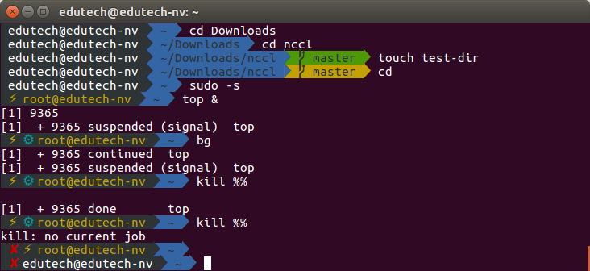
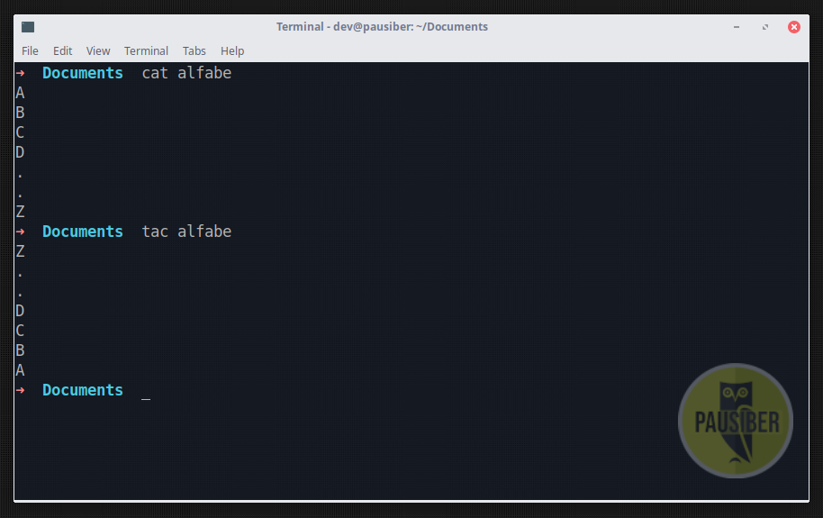
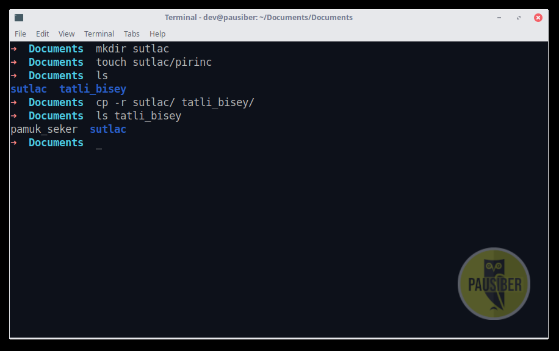
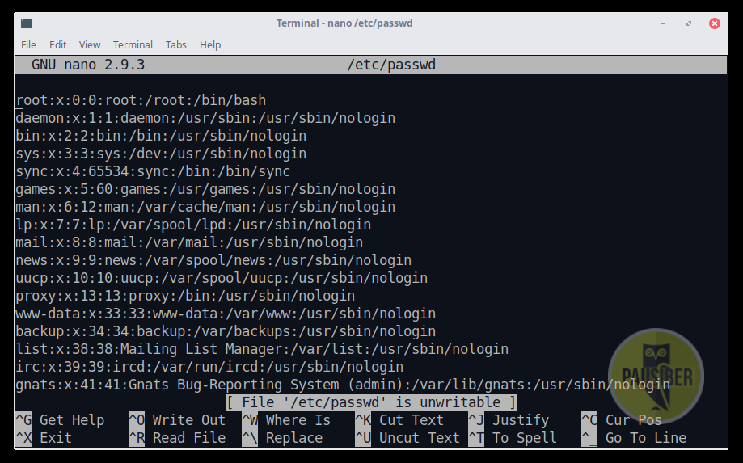
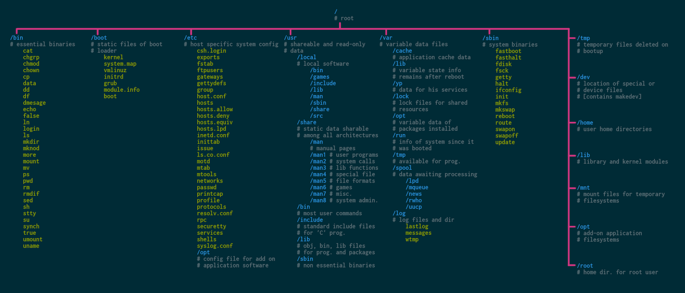
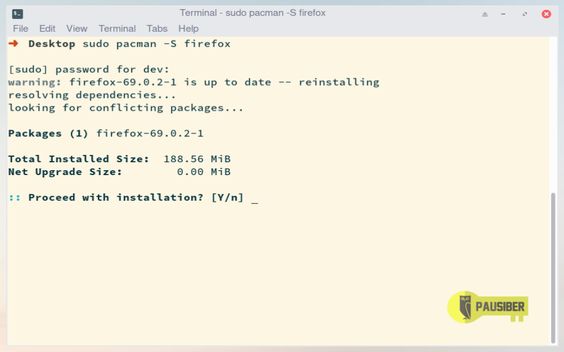
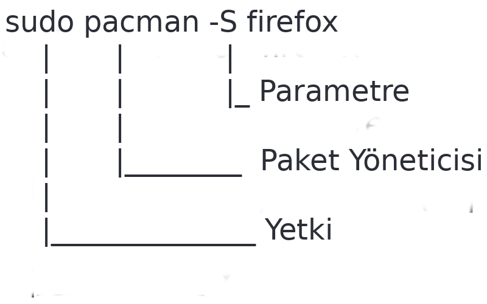
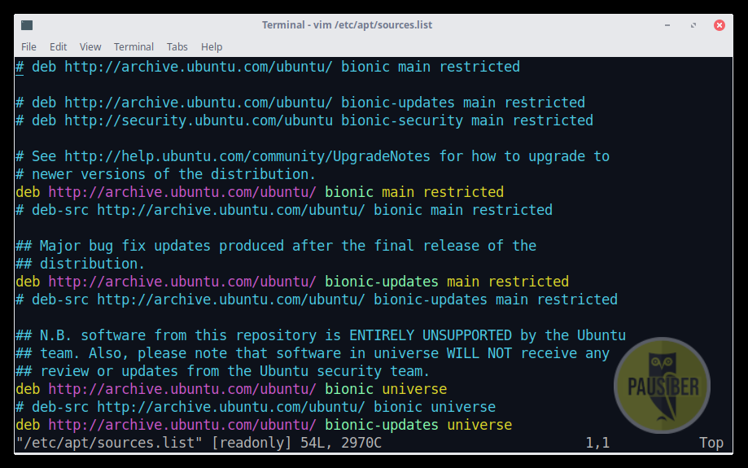
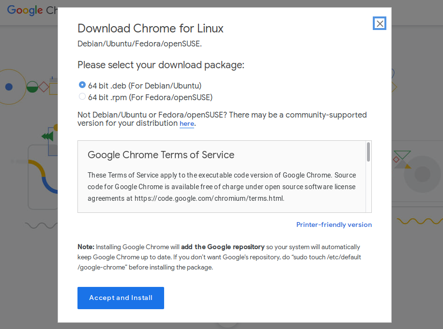

# Hafta 1

**Amaç :** Terminal kullanımını kavratmak, dosya sistem hiyerarşisini kavratmak, paket yöneticisi kavramından bahsetmek

**Yazarlar :** [**boratanrikulu**](https://github.com/boratanrikulu) **&&** [**hasantezcan**](https://github.com/hasantezcan)

---

## Terminal Nedir ?

Terminal, işletim sisteminizi shell ile kullanmanızı sağlayan bir arayüzdür. GNU/Linux dağıtımlarında SHELL olarak genellikle BASH kabuğu (shell) kullanılır.

Windows'ta bunun karşılığı CMD denebilir.

Windows'ta şuana kadar hiç CMD'ye girmeden hayatta kalabiliyorsanız, aslında GNU/Linux dağıtımlarının **bir çoğunda da** terminale hiç uğramadan da hayatta kalabilirsiniz..

<p align="center">
	
</p>

---

## Peki neden size terminal kullanımı anlatıyoruz ?

İşletim sistemine tamamen hakim olmak, isteklerinizi grafik arayüzünün hantallığına takılmadan yapmak ve işlerinizi çok daha hızlı görmek açısından terminal kullanımı önemlidir.

Ayrıca mesleğimiz gereği burada çok işimiz oluyor **:)**.

Örneğin en basitinden, bir kaç hafta içersinde eğitimini alacağınız git kullanımının terminal üzerinden yapılması gibi. Onun dışında, yazdığınız herhangi bir programı derlerken terminal kullanmanız gerektiği gibi faktörler terminal kullanımına alışmanız açısından önemlidir.

Bu arada html/css derslerinde yazdığınız ya da yazcağınız uygulamaları bundan bir kaç hafta sonra hep birlikte, hiç bir şekilde grafik arayüzü (GUI) kullanmadan yalnızca terminali kullanarak; bir sunucu üzerinde ayağa kaldıracağız **:)**.

Yani şuan öğreneceğiniz bilgiler başka anlamsız, hantal ve yavaş olarak gözükecek olsa bile aslında ilerki mesleki hayatınızda çokça rahat etmenizi sağlayacaktır.

Ne kadar erken öğrenmeniz sizin için o kadar iyi olacaktır.

---

## SHELL Nedir ?

SHELL işletim sistemlerinin servislerini kullanmak amacıyla kullanılan bir kullanıcı arabirimidir (user interface), bir programdır.

Kabuk (shell) , çekirdek ile kullanıcı arasında ara görev görür.

Bir çok kabuk çeşidi vardır;

- sh
- bash
- zsh
- csh
- ksh
- tcsh

Önünüzde bulunan PauSiber Dev'de ise kabuk yani shell olarak ZSH kullanılmaktadır. Kabuk olarak BASH yerine ZSH kullanma sebebimiz; ZSH'ın BASH'e göre daha fazla özellik içermesi.

Bi de şekil filan yani .s.s.s

<p align="center">
	
</p>

<p align="center">
	
</p>

---

## Temel Komutlar

Terminalda kullanabileceğiniz sayısız uygulama, sayısız komut var. Biz bu eğitim sırasında yalnızca temel düzeyde olan komutları göstereceğiz.

---

### `ls [list]`

Herhangi bir dizinin içini görmek için kullandığımız komuttur.

Örneğin terminalde aşağıdaki gibi bir komut yürütürsek, o sırada bulunduğumuz dizinin içindeki tüm dosya dizinlerin çıktısı görürüz

```bash
	ls
```

<p align="center">
	
</p>

---

GNU/Linux'da bir dosyanın gizli olması için başına **"."** konması yeterlidir. Eğer bir dosyanın başında **"."** ifadesin var ise `ls` sorgularında gösterilmez.

Bu yüzden az önce yaptığımız sorgu gördüklerimiz bulunduğumuz satırdaki tüm dosya ya da dizinleri göstermedi.

Gizli dosya ve dizinler dahil tüm her şeyi görmek istiyor isek **--all** ya da **-a** parametresi kullanmamız gerekir.

Yani aşağıdaki gibi bir komut yürütürüz.

```bash
	ls -a
```

<p align="center">
	
</p>

Peki örneğin bulunduğumuz dizin altında bulunan tüm dosyaları tarihe ögre sıralı şekilde görüntülemek istersek ne yapmalıyız ? Aşağıdaki parametreleri kullanabiliriz.

```bash
	ls -lat
```

<p align="center">
	
</p>

---

### `man [manual]`

EE tüm parametreleri böyle tek tek öğrenecek miyiz ? Evet.

**Peki ezberleyecek miyiz ? HAYIR !**

Kullanılan neredeyse her komutun bir manual sayfası vardır. Bunları okumak için `man` komutunu kullanabiliriz. Örneğin `ls` komutunun manual sayfasını okumak için `man ls` dememiz yeterlidir.

```bash
	man ls
```

Son derece detaylı olan bu manual sayfalarında ilgili komutla ilgili tüm detaya ulaşabilirsiniz.

**Not :** manual sayfasından **q**'a basarak çıkabilirsiniz.

<p align="center">
	
</p>

Ayrıca ek bir öneri olarak; okuma kolaylığı sağlaması, aranan şeylere daha kolay ulaşma imkanı vermesi açısından, man kullanmak yerine **tldr** uygulamasını kullanabilirsiniz.

[**github.com/tldr-pages/tldr**](https://github.com/tldr-pages/tldr) *`tl;dr : "too long; didn't read"`*

<p align="center">
	
</p>

---

### `cd [change directory]`

Bulunduğumuz dizini değiştirmek için cd komutunu kullanırız.

```bash
	cd Documents/
```

<p align="center">
	
</p>

Eğer bulunduğumuz dizinin bir üstüne gitmek istiyorsak aşağıdaki gibi yapmalıyız.

```bash
	cd ..
```

---

### `pwd [print working directory]`

Bu komut bize hangi dizinin içinde olduğumuzu söyler. Yani bulunduğumuz dizinin path'ini verir.

```bash
	pwd
```

<p align="center">
	
</p>

---

### `touch`

İçi boş bir dosya oluşturmak amacıyla kullanılır.

```bash
	touch yeni_bir_dosya
```

<p align="center">
	
</p>

---

### `cat`

Bir dosyanın içeriğini terminale basar.

```bash
	cat beni_oku
```

<p align="center">
	
</p>

### `tac`  

Bir dosyanın içeriğini, ters sırada, terminale basar.

```bash
	tac beni_tersten_oku
```

<p align="center">
	
</p>

---

### `echo`

Terminal ekrine string bir ifadeyi basmak amacıyla kullanılabilir.

```bash
	echo "MESAJ"
```

<p align="center">
	
</p>

**`echo`** daha çok dosyaların içersine veri yazılırken kullanılır.

Örneğin aşağıdaki gibi bir ifade, file.txt dosyasının en son satırına "yeni veri" string'ini ekler.
```bash
	echo "yeni veri" >> file.txt
```

Eğer hali hazırda bulunan dosyadaki tüm verileri silmek ver yerine yazmak istersek **`>>`** diyebiliriz.

```bash
	echo "hepsini sil yerine yaz" > file.txt
```

---

### `less`

Dosya içeriğini vim'e benzer bir şekilde görüntelememizi sağlayan bir programdır.

```bash
	less dosya_adi
```

<p align="center">
	
</p>

---

### `mkdir [make directory]`

Dizin (klasör) oluşturmak amacıyla kullanılır. Aynı anda birden fazla klasör oluşturulabilir.

Hatta aynı anda iç içe klasörler de direkt olarak tek komutta oluşturulabilir.

```bash
	mkdir klasor_adi
```

<p align="center">
	
</p>


---

### `mv [move]`

Dosya ya da dizinlerin taşınmasını sağlar.

*Bu arada, GNU/Linux'da dosya ve dizin aynı şeydir, buna ileride değineceğiz.*

```bash
	mv pamuk_seker tatli_bisey/
```

<p align="center">
	
</p>

---

### `cp [copy]`

Dosya ya da dizinlerin kopyalanması sağlar.

```bash
	cp dosya dosya.backup
```

**"-r"** parametresi ise dizinlerin kopyalanması sağlanırken kullanılır.

```bash
	cp -r sutlac/ tatli_bisey/
```

<p align="center">
	
</p>

---

### `rm [remove]`

Dosya ya da dizinlerin silinmesi amacıyla kullanılır.

```bash
	rm dosya
```

```bash
	rm -r dizin/
```

Örneğin aşağıdaki gibi tüm sistemi tek bir komut ile silebilirsiniz. Lakin bu komutun bir çok GNU/Linux dağıtımında çalıştırılması engellidir.

```bash
	rm -rf /
```

<p align="center">
	
</p>

---

### `wget`

Wget; internet protokolleri üzerinden dosya indirme aracıdır.

```bash
	wget https://raw.githubusercontent.com/PauSiber/gnulinux/master/hafta1/hafta1.md
```

<p align="center">
	
</p>

---

### `!!`

Son komutu tekrar yürütür.

<p align="center">
	
</p>

---

### `histroy`

Önceden yürütülen komutları listeli halde gösterir.

```bash
	histroy
```

Daha düzenli şekilde görebilmek aşağıdaki gibi bir komut yürütebilirsiniz.

```bash
	history | less
```

<p align="center">
	
</p>

---

## Bir Kaç Kısa Yol

**`ctrl + a`** ile terminalde yazılı olan ifadenin **`ilk başına`** gidilir.

**`ctrl + e`** ile terminalde yazılı olan ifadenin **`en sonuna`** gidilir.

**`ctrl + l`** ile terminal **`temizlenir`**.

**`ctrl + d`** ile terminalden **`çıkış`** sağlanır.

**`ctrl + shift + c`** ile **`kopyalama`** yapılır.

**`ctrl + shift + v`** ile **`yapıştırma`** yapılır.

**`ctrl + c`** ile çalışan uygulama **`durdurulabilir`**.

**`ctrl + z`** çalışan uygulama **`arkaya atılır`**.

**`ctrl + u`** o anda **`satıra yazılan herşeyi siler`**, temizler.

---

## Terminal'de Çalışan Metin Editörleri

#### `nano`

<p align="center">
	
</p>

#### `vim`

<p align="center">
	
</p>

---

## GNU/Linux'da Dosya Sistem Hiyerarşisi

UNIX tabanlı ya da esinlenilmiş işletim sistemlerinin dosya sistem hiyerarşisi Windows işletim sisteminden oldukça farklıdır.


<p align="center">
	
</p>

<p align="center">
	
</p>

GNU/Linux sistemlerde bir dosya dizin hiyerarşisi vardır. Vu hiyerarşinin en üstünde `"/"` yani `root(kök)` dizini bulunur. Bu, tüm sistemin referans noktasıdır.

<p align="center">
	
</p>

#### `/ [root(kök) dizini]`

Tüm dizinlerin üzerinde bulunan dizindir. Tüm dizinler buradan dallanarak oluşturulur.

#### `/bin`

Sisteminin temel komutlarının bulunduğu dizindir.

Kullandığımız çoğu komut bu dizin altında bulunur. `(cat, mkdir, cp, ls, mv, rm )`

#### `/etc`

Sistemin bütün yapılandırma dosyaları bu dizin altında bulunur. Yapılandırma dosyası; bir programın işleyişini kontrol etmek için kullanılan yerel bir dosyadır.

#### `/home`

Kullanıcıların kayıtlı dosyalarını, kişisel ayarlarını vb. içeren ev dizinleridir.
Windows'daki Documents and Settings'e benzetebiliriz. Her bir yeni kullanıcı için alt dizin olarak altına oluşturulur.

``` bash
- /home
	|-----> dev
	|-----> hasantezcan  
	|-----> boratanrıkulu
```

#### `/root`

Root kullanıcısının home dizinidir. Diğer home dizinlerinden bi farkı yoktur.

#### `/lib`

Kernel modülleri ve paylaşılan kütüphane dosyaları bu klasörde bulunur. Var olan çekirdek modüllerini `/lib/modules/[versiyon_numarası]` içersinde bulabilirsiniz.


#### `/var`

Sistem değişkenlerini saklar. Home dizini kullanıcıların dosyalarını depolarken, /var dizini içinde de programların oluşturduğu veriler tutulur.

#### `/opt`

GNU/Linux dosya dizin hiyerarşisine uymayan programların kurulduğu dizindir. Henüz sizlere bahsetmediğimiz "Bağamlılık" kavramına uymayan bu programlar sistemden yalıtılmış halde /opt dizini altından çalışmayı sürdür.

<p align="center">
	
</p>

**Not :** GNU/Linux sistemlerde **`herzaman bir dizin içersinde bulunursunuz.`** Yani ağaç yapısının dışına çıkamazsınız.

---

Bir dosyanın yeri tarif ederken kullanıdiğimiz iki türlü yol vardır. Bunlar **`Tam Yol`** ve **`Göreceli Yol`** dur.

**Tam Yol :** Herzaman `root` dizininden başlar ve hedef gösterdiğimiz dizine kadar devam eder. Bu komutu hangi dizinde olursak olalım çalıştırdığımızda sonuç alırız. Çünkü bu tarif hiç bir zaman değişmez. Bunun nedeni de referans aldığı ilk yolun root olmasıdır.

**Göreceli Yol :** Bu tarifin herzaman geçerliliği yoktur. İçersinde bulununan dizine göre değişiklik gösterir.

---

## Paket Yöneticisi Nedir ?

Hadi şimdi gidip Windows bir sistem deneme amaçlı bir uygulama kuralım. Örnek olması açısından firefox kurulumu yapalım.

Kurulum için ilk olarak browser açılmalı, ilgili site bulunmalı, ilgili exe dosyası sisteme indirilip, çalıştırılmalı ve ardından kurulum adımları uygulanmalıdır.

**Ne kadar ilkelce değil mi ?**

GNU/Linux dağıtımlarında böyle bir şey yok arkadaşlar. Paket yöneticisi diye bir kavram var. Paket yöneticisi ile tek bir komut ile istediğiniz uygulamayı kullandığınız dağıtımın **`repo`**'larından direkt olarak çekip kurabilirsiniz.

Paket yöneticisi yalnızca bir programdır ama dağıtımdan dağıtıma farklılık gösterir, her paket yöneticisi her dağıtımda kullanamazsınız.

Örneğin Archlinux tabanlı dağıtımlarda Pacman isimli paket yöneticisi kullanılır.

Pacman dışında, archlinux tabanlı olmayadan dağıtımlarda kullanılan, bir çok paket yöneticisi vardır.

- dnf(yum) `fedora`
- apt `debian`
- portage `gentoo`
- zypper `opensuse`

Paket yöneticilerinin kullanımları farklılık gösterebilir. Ancak temelde bütün paket yöneticileri aynı işi yaparlar.

Hadi şimdi bir de PauSiber Dev üzerinde firefox kurulumu gerçekleştirelim. Bunun için aşağıdaki komutu yürütmemiz yeterlidir.

```bash
	sudo pacman -S firefox
```

<p align="center">
	
</p>

Şimdi bu komutu inceleyelim..

<p align="center">
	
</p>

Burada **`sudo`** ifadesini kullanma sebebimiz işlemin sistem dosyaları üzerinde gerçekleşiyor olması. Bu yüzden komutun root yetkisi ile çalışması için komutun başına **`sudo`** ifadesini ekledik.

Gördüğünüz gibi kullanımı oldukça basit. Pacman paket yöneticisinin parametreleri ile ilgili bilgiye aşağıdaki tablodan erişebilirisiniz.

Tablo başlangıçta oldukça korkunç gözükecektir ama paket yöneticisi kullandıkça alışacağınızın garantisi veririz **:)** .

| PACMAN | Açıklama |
|:--------:|:--------:|
| pacman -Ss **`packageName`** | paket arar |
| pacman -S **`packageName`** | paket yükler |
| pacman -Rsn **`packageName`** | paket siler |
| pacman -Qdtq \| pacman -Rs - | herhangi bir pakete bağlı olmayan gereksiz paketleri siler |
| pacman -Sy | repo paket bilgilerini günceller |
| pacman -Syu | yüklü paketleri günceller |
| pacman -Sw **`packageName`** | paketi yalnızca indirir (paket yöneticisi cache konumuna) |
| ls /var/cache/pacman/pkg/ | paket yöneticisi cache'ni görüntüler |
| pacman -U **`/path/to/packageName.pkg.tar.xz`** | paketi dosya ile yükler |
| tail -f /var/log/pacman.log | paket yöneticisi log'larını gösterir |
| pacman -Si **`packageName`** | repo'daki bir paketin bilgisini gösterir |
| pacman -Qi **`packageName`** | yüklü olan bir paketin bilgisini gösterir |
| pacman -Q \| less | yük olan tüm paketleri listeler |
| pacman -Ss \| less | repo'da bulunan tüm paketleri listeler |
| pacman -Ql **`packageName`** | yüklü olan paketin dosyalarının konumlarını gösterir |
| less /etc/pacman.d/mirrorlist | paket kaynak adreslerini listeler |
| pacman -Qsq > packages.list | yüklü olan tüm paketlerin isimlerini packages.list dosyasına kaydeder |
| less /etc/pacman.conf | paket yöneticisi ayarlarını gösterir |

---
Kaynak: https://boratanrikulu.dev/pacman-ve-apt-cheatsheet/

## REPO Kavramı Nedir ?

Az önce paket yöneticisi ile birlikte uygulamaların nasıl kurulacağını öğrendik.

**Peki bu paketler nereden geliyor..** İşte burada REPO kavramı ortaya çıkıyor. Her dağıtımın kendisine ait bir REPO'su vardır. PAket yöneticisi ile indirilip kurulan uygulamalar bu REPO'lardan gelir.

REPO adreslerini aşağıdaki gibi görüntüleyebiliriz. Ama lütfen bu dosyaları bir bilginiz yok ise değiştirmeyin.

```bash
	vim /etc/apt/source.list
```

PauSiber Dev'de REPO olarak [http://archive.ubuntu.com/ubuntu/](http://archive.ubuntu.com/ubuntu/) kullanılmaktadır.

<p align="center">
	
</p>

---

## REPO'da Olmayan Uygulamalar

REPO'larda yalnızca açık kaynak uygulamalar bulunabilir. Örneğin Google Chrome kapalı kaynak bir uygulamadır. Bu durumda ne yapacağız ?

**Not :** Chromium açık kaynak olduğu için REPO'larda mevcuttur.

Eğer REPO'larda bulunmayan bir uygulamaya kurulacak ise ilk yapılması gerek uygulamanın dağıtıcının sitesinden hangi şekilde edinilmesi gerektiğine bakmaktır. Çünkü bir çok farklı şekilde dağıtılıyor olabilir.

Örneğin Google Chrome için bir **`deb`** paketi indirmek gerekirken, Spotify kurulumu için REPO listemize ek bir kaynak adresi eklememiz gerekir.

Bu yüzden lütfen dışarıdan bir uygulama kuracaksınız, forumlara ya da youtube'a bakmak yerine, dağıtıcının sitesinden bakın. Orada kesinlikle bir bilgi olacaktır.

<p align="center">
	
</p>

<p align="center">
	
</p>

---

## AUR(Arch User Repository) Nedir ?

AUR, archlinux topluluğunun geliştirdikleri uygulama paketlerini, kütüphaneleri ve daha bir çok şeyi tüm archlinux topluluğuyla paylaştığı repodur. Topluluk üyeleri bu repoya kendi geliştirdikleri uygulama paketlerini yükleyebilir.AUR'da bulunan paketler ana repoda yoktur ve bu paketlerin güvenliği kulllanıcının sorumluluğuna aittir. AUR'da bulunan paketler topluluk tarafından oylanarak olumlu yönde oy almış paketler ana repoya taşınabilir.

Kaynak: [**aur.archlinux.org**](https://aur.archlinux.org/)

## AUR'dan Paket Kurulumu

Birlikte ana repoda olmayan ama AUR'da bulunan google chrome'u bilgisayarımıza kuralım. Bunun için ilk olarak `git clone` komutuyla dosyayı bilgisayarımıza çekelim ve `PKGBUILD` ile kurulumu gerçekleştirelim.

[`Google Chrome`](https://aur.archlinux.org/packages/google-chrome/)

## AUR Helpers

Ana repodan bir paket yüklemek istediğimizde pacman isimli paket yöneticisini kullanıyoruz. Peki Arch User repo'sundan da paket kurmak için kullanabileceğimiz  **paket yöneticileri** mevcut mudur?
Burada devreye AUR helper'lar giriyor. Arch user repo içinde bir paketi aramak ya da yüklemek için kullandığımız paket yöneticilerine **AUR helpers** diyoruz. Aşağıda örnek helper'lar listelenmiştir.
- `aura`
- `pacaur`
- `pakku`
- `pikaur`  
- [`trizen`](https://aur.archlinux.org/packages/trizen)
- `yay(yet another yogurt)`
- `yaourt`

Yukarıda bazı AUR helperlar listelenmiştir. Bunlardan yaourt bir çok güvenlik açığı barındırmaktadır ilgili reddit paylaşımını aşağıda bulabilirsiniz. Biz hem güvenli hem de kullanımı daha basit olduğu için trizen kullanmayı tercih ediyoruz. AUR helperlara [**`bu`**](https://wiki.archlinux.org/index.php/AUR_helpers) yazıda daha detaylı bir şekilde göz atabilirsiniz.

`Neden yaourt değil ?`: https://www.reddit.com/r/archlinux/comments/4azqyb/whats_so_bad_with_yaourt/

## Bu hafta neler yaptık ?

- **Terminalin ne olduğu** ve neden kullanmamız gerektiğini öğrendik
- **Temel komutlar** ile terminal kullanıma ilk adımı attık.
- Terminal üzerinde kullanabileceğimiz **yararlı kısayollar**ı öğrendik.
- Terminal üzerinde çalışan **metin editörleri**ni denedik.
- GNU/Linux’da **dosya sistem hiyerarşisi**nin nasıl olduğunu temel düzeyde öğrendik.
- **Paket Yöneticisi** , **REPO** , **MIRROR** , **AUR** ve **AUR Helper** kavramlarını öğrendik.
