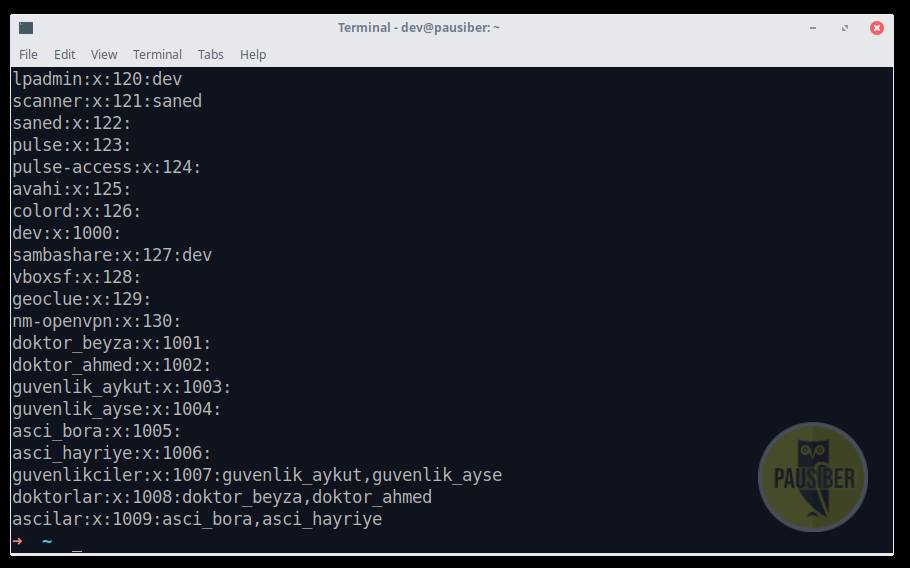
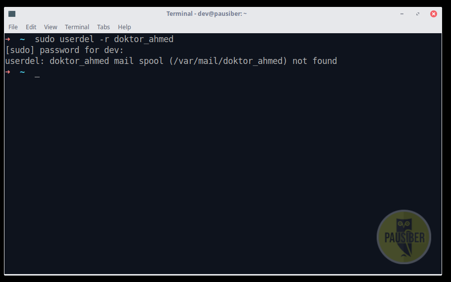

# Hafta 2

**Amaç :** Kullanıcı-grup yönetimi ve dosya-dizin izinleri..

**Yazarlar :** [**boratanrikulu**](https://github.com/boratanrikulu) **&&** [**hasantezcan**](https://github.com/hasantezcan)

---
## Hastane örneği..

Bir hastane düşünün, bu hastanede çalışanların kullanabileceği yanlız bir tane bilgisayar var. Ve hastanemizde çalışan üç ana meslek grubu var. Bunlar; **doktorlar**, **güvenlik görevlileri** ve **aşçılar**.

<p align="center">
	
</p>

Bu çalışanların tek bir bilgisayarı kullanmasının iki farklı seneryosu olabilir.

#### **`1 - Üç meslek grubu da aynı bilgisayarı "tek oturum" şekilde kullanabilir.`**

Bu durumda doktor, bilgisayarı kullandığı zaman, olması gerektiği gibi hastalarının; raporlarına, filimlerine, ameliyat görüntülerine vb.. bilgilere ulaşabilir. Aynı zamanda diğer meslek grupları ile ortak bir bilgisayar kullandığından; **güvenlik kameralarına**, o aynın **mutfak masraflarına** da bakabilir.

 Ve bu durum diğer meslek grupları içinde geçerlidir. Bir güvenlik görevlisinin ya da aşçının herhangi bir hastanın raporlarına erişebilmesi ne kadar güvenli ve doğurudur?

 işte bu durumun yaşanmaması için, her bir çalışan için ayrı bir kullanıcı oturumu oluştururuz.

#### **`2 - Herbir çalışan için ayrı bir oturum açılabilir.`**

Bu durumda herbir çalışanın kendine ait bir **kullancısı** olacağından bir önceki durumda yaşanan dosya erişim karmaşası bu sefer olmayacaktır. Yani hiç bir aşçı, güvenlik kameralarına erişip bu kayıtlar ile oynayamayacaktır. Her bir kullanıcının yetkileri bellirli olacaktır.

---

- Şimdi gelin bu hastaneye iki tane doktor, iki tane güvenlik görevlisi ve iki tane de aşçı ekleyelim.

GNU/Linux işletim sistemlerinde, sisteme bir `kullanıcı eklemek` için;

```BASH
sudo adduser kullanıcının_adı
```

<p align="center">
	
</p>

<p align="center">
	
</p>

<p align="center">
	
</p>


Şuan sistemimize altı adet kullanıcı ekledik. Şimdi ise sistemdeki tüm kullanıcılara bakalım. Bunun için **/etc/passwd** dosyasını görüntülememiz gerekiyor.

### **`/etc/passwd`**

Sistemdeki kullancıların bilgileri bu dosyada saklanır.

Bu dosyayı görüntülemek için;
```BASH
cat /etc/passwd
```

<p align="center">
	
</p>

```BASH
dev:x:1000:1000:PauSiber Dev,,,:/home/dev:/usr/bin/zsh
```
> biraz karışık görünen bu ifadeler için ufak bir açıklama

|       ifade       |                         açıklama                        |
|:-----------------:|:-------------------------------------------------------:|
|      **dev**      |                      kullanıcı adı                      |
|       **x**       |            kullancının parolasını temsil eder           |
|     **1000**      |        kullanıcının üyelik numarasıdır. (user ID)       |
|     **1000**      | kullanıcının ait olduğu grubunn numarasıdır. (group ID) |
| **PauSiber Dev**  |             kullancı hakkında kayıtlı bilgi             |
| **/usr/bin/zsh**  |                kullanıcının shell dizini.               |


**Peki bu hastanede bir tane mi doktar var?**

Tabiki de hayır. Bir meslek grubuna dahil birden fazla çalışan olabilir. Aynı meslek grubunda bulunan çalışanların görev tanımları bibirleri ile örtüşür.


Şuan hastanemizde üç farklı meslek grubuna ait ikişer tane çalışanımız var. Gelin şimdi bu meslek grupları için sistemizde bunu ifade edecek yeni gruplar oluşturalım.

GNU/Linux işletim sistemlerinde, sisteme bir `grup eklemek` için;

```BASH
sudo groupadd grubun_ismi
```
<p align="center">
	
</p>

Sistemimize üç adet yeni grup ekledik. Bu grupları görüntülemek için;

```BASH
cat /etc/group
```

<p align="center">
	
</p>

Son görselde de görüldüğü üzere bizim eklediğimiz grupların haricinde, öceden eklediğimiz kullacılar da burda gözükmekde. Ör: "doktor_beyza" gibi. **Peki bu nasıl oluyor?**

GNU/Linux işletim sistemlerinde, sisteme yeni bir kullanıcı eklediğinizde, sisteme aynı anda bu kullanıcı adınında bir de grup ekler.

Evet, şuan hastanemizde altı adet çalışan ve bunla birlikte henüz daha hiç bir personeli dahil etmediğimiz üç tane de meslek grubumuz var. Şimdi çalışanlarımızı ait oldukları meslek gruplarına ekleyelim.

Bunu yapmak için;

```BASH
sudo gpasswd --add kullanıcı_adi grup_adi
```
> Buradaki add parametresi sayesinde bir kullancıyı yeni yeni gruplara ekleyebiliyoruz.

<p align="center">
	
</p>

şimdi /etc/group 'u yeniden görüntüleyelim.

<p align="center">
	
</p>

Başarılı bir şekilde personelimizi gruplarına ekledik.

Şimdi sıra hastanenin müdüründen bahsetmeye geldi. Hastane müdürü hasatanedeki en yetkili kişidir. Doktorların, güvenlik görevlilerinin ve aşçının erişebildiği verilerin hepsine erişebilir. Aslında o da bir çalışandır. Fakat yetkileri onu diğer çalışanlardan ayrıştırır.

GNU/Linux sistemlerde bahsettiğimiz hastane müdrünün karşılığı root kullanıcısıdır.
Root kullancısı sistemdeki en yetkili kullancıdır. Sistemdeki tüm dosyalara erişim yetkisi vardır.

**Çalışanların odaları**  
Hastanemizde çalışan tüm personelin kendine ait bir odası vardır. Çalışanlar bu odalarda kendi kişisel eşyalarını saklarlar.

GNU/Linux işletim sistemlerinde sisteme kayıtlı her insan kullancı için /home dizini altında o kullancıya tahisis edilmiş bir alan mevcuttur. Kullanıcılar bu dizinde verilerini diledikleri şekilde depolarlar.

root kullancısının da kendine ait bir odası vardır. Fakat root kullacısına ayrılmış bu alan direk root dizini altında ayrılmış /root dizinidir.


**Sistemden kullancı silme**   
Hastanemizden bir çalışanı işten çıkarmamız gerekiyor bunu nasıl yapıcaz?

```BASH
userdel -r kullancı_adi
```

şimdi sistemizie kayıtlı olan doktor_ahmedi işten çıkaralım.

<p align="center">
	
</p>

**Kullancının parolasını değiştirmesi**
Bir kullanıcı dilediği zaman kullancı parolasını değişrirebilir. Bunu yaparken..

```BASH
passwd
```

<p align="center">
	
</p>

>Güvenlik önmelemi amaçıyla kullancı parolasını girerken bu ekrana basılmaz.


**Grup silme**


---

## Dosya ve Dizin Kavramları

**GNU/Linux'ta her şey birer dosyadır**. [**[1]**](https://stackoverflow.com/a/10893965)

Özünde **dizinler de dosyaların konumunu belirten birer özel dosyadır.** Dizinler veri içeremez, yalnızca konum belirtmek amaçlı kullanılabilirler. Dizinlerin bir türü yoktur, uzantısı yoktur. Dosyaların ise bir türü vardır, uzantısı bulunabilir.

Dizin ve dosya isimleri aynı olamaz.

---

## Dosya ve Dizin İzinlerinin İncelenmesi

**ls** ile dosyaların izinleri incelenebilir.

```bash
	$ ls -l fileName
```

<p align="center">
	
</p>

Dosya ve dizin işlemlerine bakıldığında 10 karakterden oluşan bir yapı görünür.

Bu karakterler  

- dosyalar için **r**[read] okumak, **w**[write] yazmak, **x**[execute] çalıştırmak  
- dizinler için **r**[read] içeriğini görüntüleyebilmek, **w**[write] alt dosya ve dizinler oluşturabilmek, **x**[execute] cd ile içine girebilmek

izinlerini temsilen kullanılır.
<br><br>
Bunları aşağıdaki gibi üçerli olarak gruplandırarak incelemekte fayda vardır.

<p align="center">
	
</p>

Yani bu örnektekinin;  

- bir **dizin** olduğunu,
- dosya kullanıcısının **okuma/yazma/çalıştırma**,  
- dosya grubunun **okuma/çalıştırma**,  
- diğer herkesin de **okuma/çalıştırma**  

iznine sahip olduğunu görüyoruz.

---

#### Chmod ile İzinlerin Düzenlemesi [Text Method]

Chmod'un 3 temel parametresi vardır, bunlar aşağıdaki gibidir.

| Parametre | Anlamı | Açıklama |
|:---------:|:--------:|:-------:|
| **-R**    | Recursive | Objenin tüm alt klasörlerine de aynı işlemin uygulanması amaçlı kullanılır |
| **-f**    | Force | Ortaya çıkan hataların gözardı yapılarak işlemin uygulanmasını zorlamak amaçlı kullanılır |
| **-v** | Verbose | İşlemin detayını göstermesi amaçlı kullanılır |

Text method'da genel syntax aşağıdaki gibidir.

```bash
	$ chmod who=permission fileName
```

Kim olduğunu belirtmek için **u**, **g**, **o**, **a** kullanılır.

| Text | Class | Açıklama |
|:----:|:-----:|:--------:|
| **u** | Owner | Dosyaya sahip olan kullanıcı |
| **g** | Group | Dosyanın ait olduğu grup |
| **o** | Other | Diğer herkes |
| **a** | All | Herkes (**ugo** ile aynı anlama gelir) |

Örneğin bir dosya için dosya kullanıcısına okuma/yazma/çalıştırma izinleri vermek istiyorsak aşağıdaki gibi yapabiliriz.

```bash
	$ chmod u=rwx fileName
```

<p align="center">
	
</p>

Yalnızca **" = "** operatörü yoktur. Diğer operatör ve amaçları da aşağıdaki gibidir.

| Operator | Açıklama |
|:----:|:-----:|
| **+** | Yetkiyi ilgili kullanıcılara ekler |
| **-** | Yetkiyi ilgili kullanıcılardan çıkarır |
| **=** | Yetkiyi eşitler |

Örneğin az önceki örnekte **" u=rwx "** demiştik. Bunun yerine direkt olarak çalıştırma iznini **" + "** ile ekleyebilirdik.

```bash
	$ chmod u+x fileName
```

<p align="center">
	
</p>

Ya da örneğin diğer herkesin yetkisini 0 yapmak istersek aşağıdaki gibi yapabiliriz. Bu şekilde diğer herkesin sahip olduğu yetkileri silmiş oluruz.

```bash
	$ chmod o= fileName
```

Ya da örneğin kullanıcı hariç diğer herkesten çalıştırma izinlerini çıkarmak istiyorsak aşağıdaki gibi yapabiliriz.

```bash
	$ chmod go-x fileName
```

---

#### Chmod ile İzinlerin Düzenlemesi [Numberic Method]

Her yetkinin numarasal olarak bir karşılığı vardır. Bunlar aşağıdaki gibidir.

| İzin | Numara Karşılığı |
|:----:|:------:|
| **r** | 4 |
| **w** | 2 |
| **x** | 1 |

Numarasal method'da genel syntax aşağıdaki gibidir. Burada **X** her grup için yetki numaralarının toplamına eşittir.

```bash
	$ chmod XXX fileName
```

Örneğin elimizde **" -rw-r--r-- "** olduğu varsayalım. Bu ifade **644** ile ifade edilebilir. Eğer yetkiyi text değil de direkt olarak numarasal formda görmek istersek **stat**'ı kullanabiliriz.

```bash
	$ stat -c %a fileName
```

<p align="center">
	
</p>

**644** yetkisi numarasal method ile olarak bu şekilde :

```bash
	chmod 644 fileName
```

Text method'u ile de bu şekilde :

```bash
	chmod u=rw fileName && chmod go=r fileName
```

ifade edilmektedir, ikisi de aynı işlemi yapmaktadır.

---

#### Chown ile Sahipliğin Değiştirilmesi

Her dosyanın (ya da dizinin) ait olduğu bir kullanıcı ve bir grup olmalıdır. Eğer dosya ya da dizinlerin sahipliğini değiştirmek istiyorsak **chown**'u kullanabiliriz.

Genel syntax örnekleri aşağıdaki gibidir.
```bash
	$ chown newOwner fileName
```
```bash
	$ chown newOwner:newGroup fileName
```
```bash
	$ chown :newGroup fileName
```

<p align="center">
	
</p>

Eğer tüm alt klasör ve dizinler için de sahipliği değiştirmek istiyorsak, chmod'da da olduğu gibi, recursive parametresi olan **-R** kullanılır.

<p align="center">
	
</p>

---

## Chattr ile bişiler

...  
...

---

## Bu hafta neler yaptık ?

- Elimizde bulunan kullanıcının parolasının nasıl değiştirileceğini,  
	sisteme yeni kullanıcıların nasıl ekleneceğini,  
	kullanıcıların gruplara nasıl dahil edileceğini,  
	yeni grupların nasıl oluşturulacağını,  
	kullanıcıların gruplardan nasıl çıkarılacağını genel olarak öğrendik.  
- Dosya ve dizin kavramlarının özünde aynı şeyi ifade ettiğini,  
	dosya-dizin izinlerinin text ve numeric method'lar ile nasıl belirleneceğini,  
	dosya-dizin sahipliklerinin nasıl değiştirileceğini genel olarak öğrendik.
